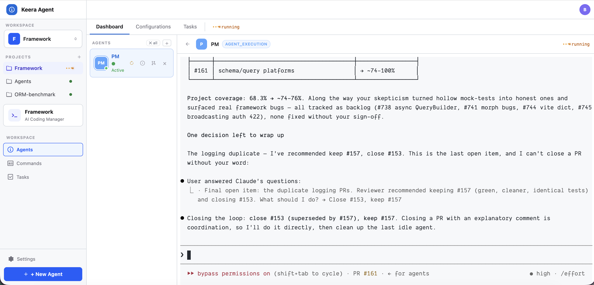

# keera-agent

A local-first AI agent manager built with FastAPI (Python) and React (TypeScript).



*The main dashboard: workspaces and projects on the left, the agents panel in the middle, and a live agent terminal on the right.*

## Stack

- **Backend:** Python 3.13+, FastAPI via `fastapi-startkit`, Masonite ORM (async), SQLite
- **Frontend:** React 19 + TypeScript, Inertia.js, Vite, Tailwind CSS v4
- **Terminal:** xterm.js (frontend) + Python `pty` module over WebSocket

## Quick Start

The fastest way to set up a dev environment is the install script:

```bash
./bin/install.sh
npm run dev
```

`bin/install.sh` is a one-command, idempotent dev onboarding script. It:

- Checks that `uv`, `node`, and `npm` are installed (with install hints if any are missing)
- Installs dependencies with `uv sync` and `npm install`
- Creates `.env` from `.env.example` if it doesn't exist (never overwrites an existing `.env`)
- Runs the dev database migrations (`uv run python artisan db:migrate`)

When it finishes, start the dev server (FastAPI + Vite) with `npm run dev`.

### Manual setup

```bash
# Install dependencies
uv sync
npm install

# Run migrations
uv run python artisan db:migrate

# Start dev server (FastAPI + Vite)
npm run dev
```

## Background tasks (queue)

The app uses [TaskIQ](https://taskiq-python.github.io/) for async background jobs.
It ships with an **in-memory broker** (`app/providers/queue_provider.py`), so there
is nothing extra to install or run — no Redis, no Docker.

Define a task in `app/tasks.py` and dispatch it (fire-and-forget) from a controller
or action:

```python
from app.tasks import example_task

task = await example_task.kiq("world")
result = await task.wait_result()   # -> "processed world"
```

With the in-memory broker, `.kiq(...)` runs the task **in the dispatching process**,
so a standalone worker isn't needed. `queue:work` is provided for the upgrade path
below and prints a note if run against the in-memory broker:

```bash
uv run python artisan queue:work
```

### Check the queue is alive

`app/tasks.py` ships a `heartbeat` task that returns a liveness payload
(`status`, an incrementing `sequence`, and a UTC `timestamp`). Fire it on demand
to confirm the queue runs end to end:

```bash
uv run python -c "
import asyncio
from app.providers.queue_provider import broker
from app.tasks import heartbeat

async def main():
    await broker.startup()
    task = await heartbeat.kiq()
    print((await task.wait_result()).return_value)
    await broker.shutdown()

asyncio.run(main())
"
# -> {'status': 'alive', 'sequence': 1, 'timestamp': '...'}
```

### Upgrading to a networked broker (e.g. Redis)

For durable, cross-process queuing, change the **one broker line** in
`app/providers/queue_provider.py` and set `KEERA_QUEUE_REDIS_URL`:

```python
# app/providers/queue_provider.py
from taskiq_redis import RedisStreamBroker
from config.queue import QueueConfig

broker = RedisStreamBroker(url=QueueConfig().redis_url)
```

Then add the driver, run Redis, and start the worker:

```bash
uv add taskiq-redis
docker run -p 6379:6379 redis
uv run python artisan queue:work        # or: uv run taskiq worker app.providers.queue_provider:broker app.tasks
```

## Testing

```bash
uv run pytest
```

## Building for Deployment

```bash
bash bin/build.sh
```

The build outputs a self-contained deployable to `dist/` and starts the server on port `:4545`.

### Production build

For an unattended production build, run it under `caffeinate` so macOS never sleeps mid-build (the build compiles Vite assets, syncs dependencies, and then keeps a long-running server alive):

```bash
caffeinate -i ./bin/build.sh
```

`caffeinate -i` prevents the system from idle-sleeping while the command runs. `./bin/build.sh` performs the full production build:

- Builds the frontend (`npm run build`) and copies the project into `dist/`
- Patches `dist/.env` (`KEERA_APP_URL=http://127.0.0.1:4545`, `KEERA_APP_RELOAD=false`) and points the `.claude/settings.json` hooks + MCP server at that URL
- Installs Python dependencies (`uv sync --frozen`), runs database migrations, and updates the built-in agent templates
- Commits the build inside `dist/`, then starts the server on `http://127.0.0.1:4545` (reload disabled)

Because the server keeps running in the foreground, `caffeinate -i` holds the machine awake for as long as the server is up. Pass `--no-build` to skip the Vite build and only re-sync files:

```bash
caffeinate -i ./bin/build.sh --no-build
```
